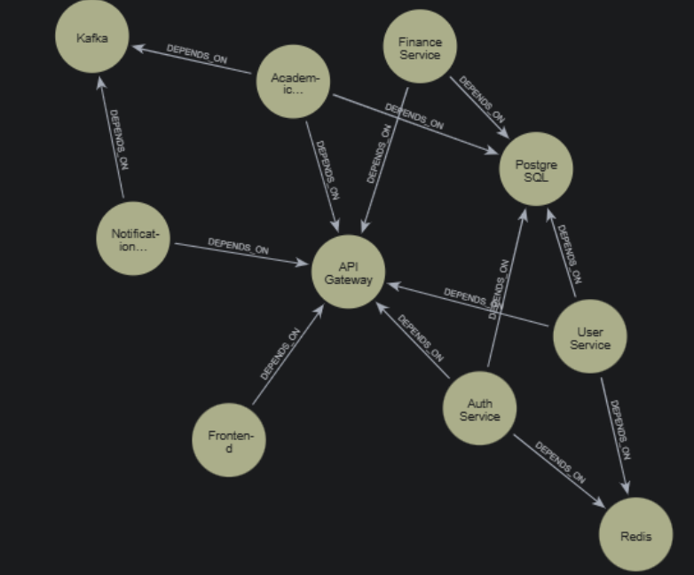
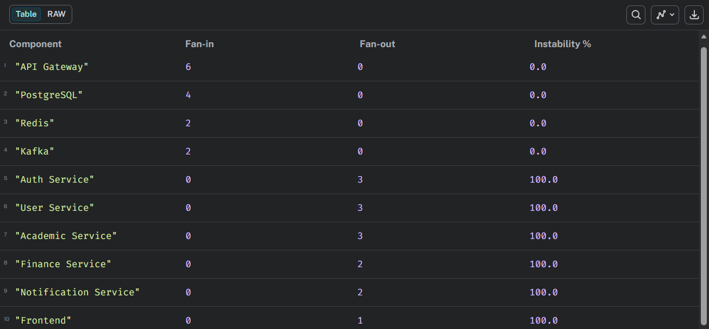

# Global Student Portal - Clean Architecture Analysis

## Dependency Graph

## Stability Metrics (Clean Architecture)

## Analysis
**Stable components** (0% instability ✅):
- PostgreSQL, Redis, Kafka, API Gateway

**Unstable components** (100% instability ✅):
- Domain/Application services (Auth, User, Academic, Finance)

**Clean Architecture validated**: Infrastructure is stable (depended ON), Domain layer unstable (depends OUT).

## Generated Using
- Neo4j Sandbox (https://sandbox.neo4j.com)
- Cypher queries for dependency modeling and stability calculation

## Metrics Formula
Instability (I) = Fan-out / (Fan-in + Fan-out)
Ideal: Domain=0%, Infrastructure=100%
